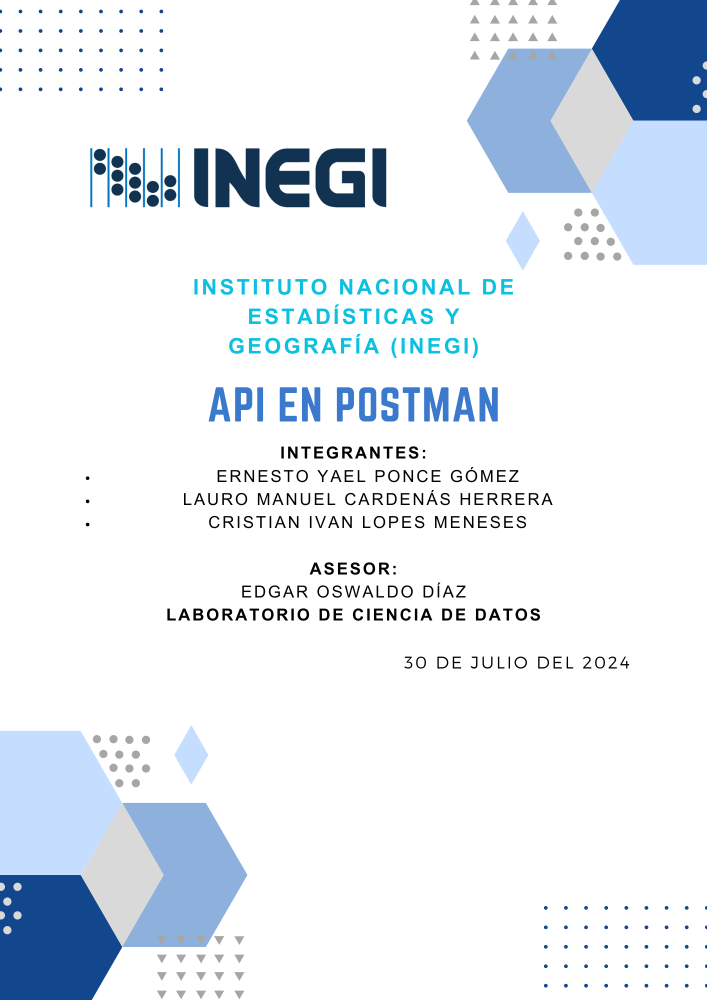
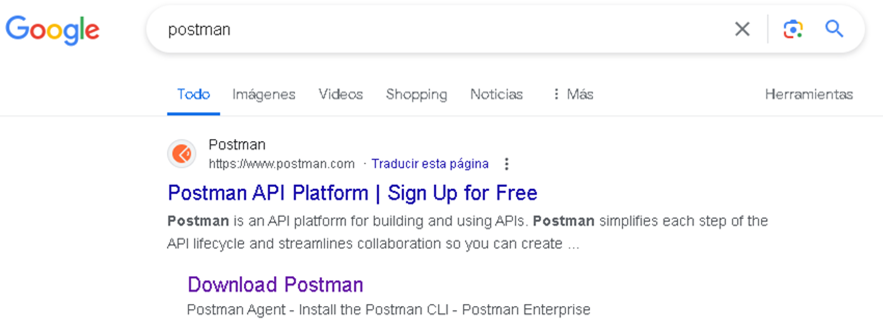
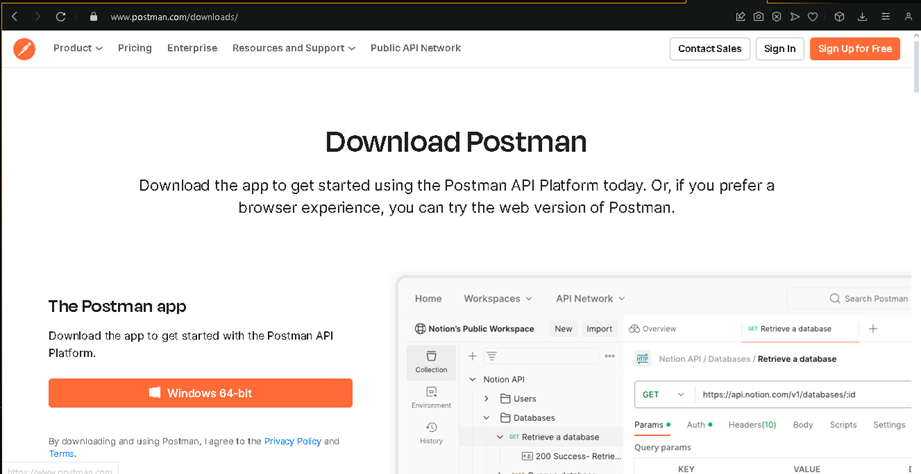
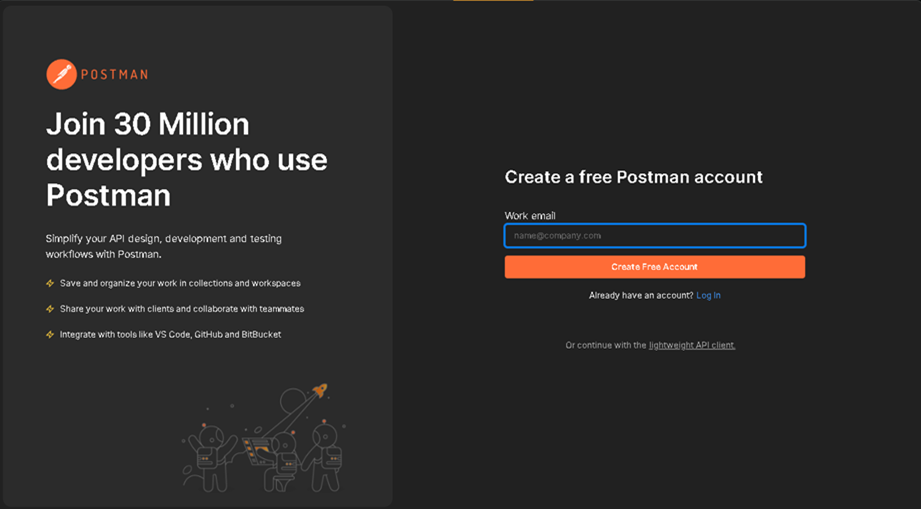
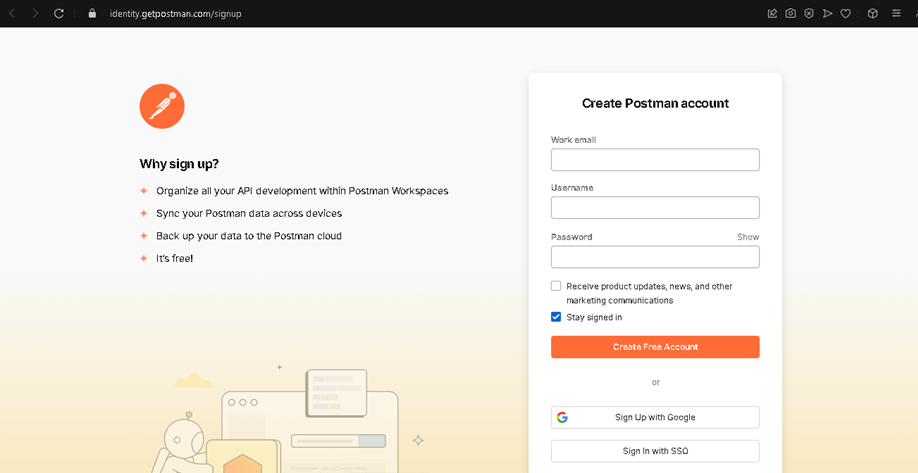
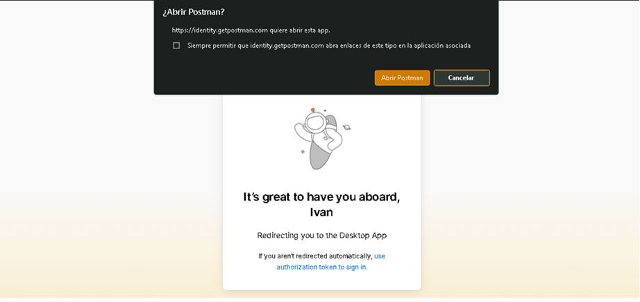
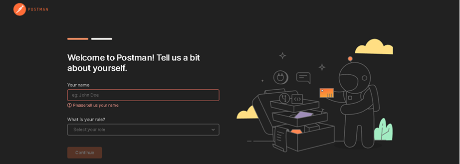
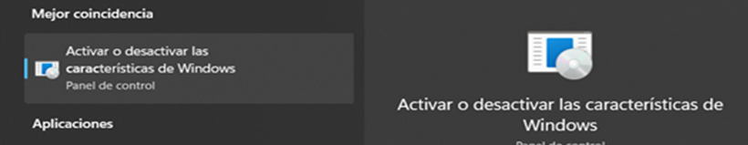
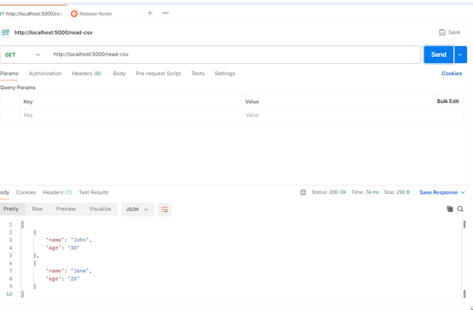

  

## Índice

- INTEGRANTES
- ASESOR
- LABORATORIO DE CIENCIA DE DATOS
- Requerimientos de instalación
- Instalación de Postman
- Instalación de WSL2
- Configuración de contenedores API en Postman
- Código
- Descripción del código
- Continuación de configuración de contenedores API
- Pruebas de contenedor
- Solicitudes en Postman
  1. Leer CSV
  2. Escribir CSV
  3. Leer JSON
  4. Escribir JSON
  5. Leer Parquet
  6. Escribir Avro
  7. Leer Avro
  8. Procesar Imagen
  9. Convertir Audio
  10. Convertir Video
  11. Crear PDF
  12. Convertir a GeoJSON
  13. Convertir TIFF
- Referencias APA
- Conclusión  

## Introducción 

Este documento detalla el desarrollo y la implementación de una API en Postman, llevada a cabo por los estudiantes Ernesto Yael Ponce Gómez, Lauro Manuel Cárdenas Herrera, y Cristian Ivan Lopes Meneses, bajo la asesoría del profesor Edgar Oswaldo Díaz en el Laboratorio de Ciencia de Datos del Instituto Nacional de Estadísticas y Geografía (INEGI). La fecha de culminación del proyecto es el 22 de julio del 2024.

El propósito de este proyecto es proporcionar una guía exhaustiva sobre la instalación y configuración de diversas herramientas necesarias para el desarrollo de servicios API, así como la manipulación de diferentes tipos de datos. El documento incluye instrucciones detalladas para la instalación de Postman y WSL2, la configuración de contenedores para la API de Postman, y ejemplos de código para la creación y manipulación de datos en varios formatos, como CSV, JSON, Parquet, Avro, imágenes, audio, video, PDF y GeoJSON.

A lo largo del documento se describen los procedimientos y comandos necesarios para:

Instalar y configurar las herramientas requeridas.
Crear y configurar un proyecto en Node.js.
Implementar rutas para manipular diferentes tipos de datos mediante una API RESTful.
Realizar pruebas de contenedores y solicitudes en Postman.
Este proyecto no solo busca crear una API funcional y versátil, sino también proporcionar un aprendizaje práctico y profundo en la manipulación de datos y la configuración de entornos de desarrollo. La experiencia obtenida y los desafíos superados a lo largo de este proyecto aportan valiosas lecciones y habilidades que serán de gran utilidad en futuros desarrollos y en el campo de la ciencia de datos y el desarrollo de software en general.  

## Requerimientos de instalación

### Instalación de Postman

  

1. En el navegador buscamos Postman y seleccionamos la segunda opción para descargar que será Download Postman.

  

2. Ingresamos a la página de Postman y descargamos para Windows 64-bit o 32-bit, según nuestra arquitectura de computadora.

  

3. Antes de continuar, pedirá que se ingrese un correo electrónico. En este caso, creamos una cuenta nueva.

  

4. Es necesario llenar el formulario con los datos solicitados.

  

5. Una vez llenado los campos y creada la cuenta, abrimos Postman.

  

6. Es importante asignar un nombre de usuario y un rol.

### Instalación de WSL2

  

1. Buscamos "Activar o desactivar características de Windows" y damos enter.

  

2. Nos abrirá una pestaña con varias opciones. Seleccionamos "Subsistema de Windows para Linux" y "Virtual Machine Platform" para poder activar Ubuntu en nuestra computadora sin necesidad de descargar una máquina virtual.

  

3. Buscamos en el buscador de nuestra computadora la tienda oficial de Microsoft Store y damos enter.

  

4. Descargamos e instalamos Ubuntu para hacer las pruebas necesarias con todos los contenedores que requerimos.
5. Estos serán todos los pasos para instalar WSL2 y poder hacer todas nuestras pruebas.

## Contendores postman api configuración

1. Creamos un proyecto en Node.js
   • Abrimos la una terminal con la ruta donde desemos crear nuestro en la ubicación que gustemos y corremos los siguientes comandos:

mkdir api-server
cd api-server

• Ahora inicilizaremos nuestro proyecto correindo el siguiente comando en la ruta de dicho proyecto o terminal:

npm init -y

2. Instalar Express
   • Instalaremos Express junto con sus paquetes necesarios con el siguiente comando:

npm install express body-parser mysql2

### Codigo:

const express = require('express');
const bodyParser = require('body-parser');
const mysql = require('mysql2');
const csv = require('csv-parser');
const csvWriter = require('csv-writer').createObjectCsvWriter;
const parquet = require('parquetjs-lite');
const avro = require('avsc');
const sharp = require('sharp');
const ffmpeg = require('fluent-ffmpeg');
const { PDFDocument } = require('pdf-lib');
const fs = require('fs');
const geojson = require('geojson');

const app = express();
app.use(bodyParser.json());

// Configurar conexión a la base de datos MySQL
const db = mysql.createConnection({
host: 'localhost',
user: 'root',
password: '',
database: 'testdb'
});

db.connect((err) => {
if (err) {
throw err;
}
console.log('MySQL Connected...');
});

// Ruta de prueba
app.get('/', (req, res) => {
res.send('API funcionando');
});

// Ruta para obtener datos
app.get('/data', (req, res) => {
let sql = 'SELECT \* FROM test_table';
db.query(sql, (err, results) => {
if (err) throw err;
res.json(results);
});
});

// Rutas para manipulación de CSV
app.get('/read-csv', (req, res) => {
let results = [];
fs.createReadStream('data.csv') // Asegúrate de que 'data.csv' está en el directorio correcto
.pipe(csv())
.on('data', (data) => results.push(data))
.on('end', () => {
res.json(results);
});
});

app.post('/write-csv', (req, res) => {
const writer = csvWriter({
path: 'output.csv',
header: [
{ id: 'name', title: 'NAME' },
{ id: 'age', title: 'AGE' }
]
});

writer.writeRecords(req.body)
.then(() => res.send('CSV file written successfully.'));
});

// Rutas para manipulación de JSON
app.get('/read-json', (req, res) => {
const data = require('./data.json');
res.json(data);
});

app.post('/write-json', (req, res) => {
fs.writeFileSync('output.json', JSON.stringify(req.body, null, 2));
res.send('JSON file written successfully.');
});

// Ruta para leer Parquet
app.get('/read-parquet', async (req, res) => {
let reader = await parquet.ParquetReader.openFile('data.parquet');
let cursor = reader.getCursor();
let record = null;
let results = [];

while (record = await cursor.next()) {
results.push(record);
}

await reader.close();
res.json(results);
});

// Rutas para manipulación de Avro
const avroType = avro.Type.forSchema({
type: 'record',
fields: [{ name: 'name', type: 'string' }]
});

app.post('/write-avro', (req, res) => {
const buf = avroType.toBuffer(req.body);
fs.writeFileSync('output.avro', buf);
res.send('Avro file written successfully.');
});

app.get('/read-avro', (req, res) => {
const buf = fs.readFileSync('output.avro');
const data = avroType.fromBuffer(buf);
res.json(data);
});

// Rutas para manipulación de imágenes
app.post('/process-image', (req, res) => {
sharp('input.jpg')
.resize(200)
.toFile('output.png', (err, info) => {
if (err) throw err;
res.send('Image processed successfully.');
});
});

// Rutas para manipulación de audio
app.post('/convert-audio', (req, res) => {
ffmpeg('input.mp3')
.toFormat('wav')
.save('output.wav')
.on('end', () => {
res.send('Audio converted successfully.');
});
});

// Rutas para manipulación de video
app.post('/convert-video', (req, res) => {
ffmpeg('input.mp4')
.toFormat('avi')
.save('output.avi')
.on('end', () => {
res.send('Video converted successfully.');
});
});

// Rutas para manipulación de texto
app.post('/create-pdf', async (req, res) => {
const pdfDoc = await PDFDocument.create();
const page = pdfDoc.addPage([600, 400]);
page.drawText('Hello, world!');
const pdfBytes = await pdfDoc.save();
fs.writeFileSync('output.pdf', pdfBytes);
res.send('PDF created successfully.');
});

// Rutas para manipulación de GeoJSON
app.post('/convert-to-geojson', (req, res) => {
const data = req.body; // Expects an array of objects with coordinates
const geo = geojson.parse(data, { Point: ['coordinates[1]', 'coordinates[0]'] });
res.json(geo);
});

// Rutas para manipulación de TIFF
app.post('/convert-tiff', (req, res) => {
sharp('input.tiff')
.toFile('output.png', (err, info) => {
if (err) throw err;
res.send('TIFF converted to PNG successfully.');
});
});

const PORT = process.env.PORT || 5000;
app.listen(PORT, () => console.log(`Server running on port ${PORT}`));

#### Descripción del código

Este código es una aplicación de Express.js en Node.js que proporciona una API con varias rutas para manipular diferentes tipos de datos, incluyendo bases de datos MySQL, archivos CSV, JSON, Parquet, Avro, imágenes, audio, video, PDF y GeoJSON. Aquí está la descripción detallada de cada parte del código.
esta aplicación proporciona una serie de rutas para manipular diferentes tipos de archivos y datos, permitiendo realizar operaciones como leer, escribir, convertir y procesar información de manera sencilla y directa a través de una API RESTful.

### Continuación de configuración de contenedores api

4. Ahora instalamos las siguientes librerías para los tipos de archivos que va a usar el contenedor con los siguientes comandos:
   npm install csv-parser csv-writer parquetjs avsc sharp fluent-ffmpeg pdf-lib html-pdf winston shapefile geojson

npm install parquetjs-lite

5. Iniciar los servicios de Apache y MySQL:
   • Abrimos el Panel de Control de XAMPP.
   • Iniciamos los módulos de Apache y MySQL haciendo clic en "Start" junto a cada uno.
6. Configurar MySQL en XAMPP:
   • Abre phpMyAdmin desde el Panel de Control de XAMPP o navegando a http://localhost/phpmyadmin en tu navegador.
   • Crea una base de datos nueva llamada testdb.
   • En la base de datos testdb, crea una tabla test_table con las columnas necesarias.

CREATE TABLE test_table (
id INT AUTO_INCREMENT,
name VARCHAR(255),
PRIMARY KEY (id)
);
INSERT INTO test_table (name) VALUES ('Test Data');

7. Iniciamos nuestro servidor con el siguiente comando:
   nodeserver.js

## pruebas de contenedor

### Solicitudes en Postman

#### 1. Leer CSV:

• Método: GET  
• URL: http://localhost:5000/read-csv  
• Haz clic en "Send" para enviar la solicitud.  
• Deberías ver los datos del archivo CSV como respuesta.  

#### 2. Escribir CSV:

• Método: POST  
• URL: http://localhost:5000/write-csv  
• En la pestaña "Body", selecciona "raw" y elige "JSON" como tipo de dato.  
• Agrega un JSON como el siguiente:
json
Copiar código
[
{ "name": "Miguel", "age": 78 }
]
• Haz clic en "Send" para enviar la solicitud.  
• Deberías ver un mensaje indicando que el archivo CSV se ha escrito correctamente.  

#### 3. Leer JSON:

• Método: GET  
• URL: http://localhost:5000/read-json  
• Haz clic en "Send" para enviar la solicitud.  
• Deberías ver el contenido del archivo JSON.  

#### 4. Escribir JSON:

• Método: POST  
• URL: http://localhost:5000/write-json  
• En la pestaña "Body", selecciona "raw" y elige "JSON" como tipo de dato.  
• Agrega un JSON como el siguiente:  
json
Copiar código
{ "message": "Hello, JSON!" }
• Haz clic en "Send" para enviar la solicitud.  
• Deberías ver un mensaje indicando que el archivo JSON se ha escrito correctamente.  

#### 5. Leer Parquet:

• Método: GET  
• URL: http://localhost:5000/read-parquet  
• Haz clic en "Send" para enviar la solicitud.  
• Deberías ver los datos del archivo Parquet.  

#### 6. Escribir Avro:

• Método: POST  
• URL: http://localhost:5000/write-avro  
• En la pestaña "Body", selecciona "raw" y elige "JSON" como tipo de dato.  
• Agrega un JSON como el siguiente:  
json
Copiar código
{ "name": "Alice" }
• Haz clic en "Send" para enviar la solicitud.  
• Deberías ver un mensaje indicando que el archivo Avro se ha escrito correctamente.  

#### 7. Leer Avro:

• Método: GET  
• URL: http://localhost:5000/read-avro  
• Haz clic en "Send" para enviar la solicitud.  
• Deberías ver el contenido del archivo Avro.  

#### 8. Procesar Imagen:

• Método: POST  
• URL: http://localhost:5000/process-image  
• Haz clic en "Send" para enviar la solicitud.  
• Deberías ver un mensaje indicando que la imagen se ha procesado correctamente.  

#### 9. Convertir Audio:

    • Método: POST  
    • URL: http://localhost:5000/convert-audio  
    • Haz clic en "Send" para enviar la solicitud.  
    • Deberías ver un mensaje indicando que el audio se ha convertido correctamente.  

#### 10. Convertir Video:

    • Método: POST  
    • URL: http://localhost:5000/convert-video  
    • Haz clic en "Send" para enviar la solicitud.  
    • Deberías ver un mensaje indicando que el video se ha convertido correctamente.  

#### 11. Crear PDF:

    • Método: POST  
    • URL: http://localhost:5000/create-pdf  
    • Haz clic en "Send" para enviar la solicitud.  
    • Deberías ver un mensaje indicando que el PDF se ha creado correctamente.  

#### 12. Convertir a GeoJSON:

    • Método: POST  
    • URL: http://localhost:5000/convert-to-geojson  
    • En la pestaña "Body", selecciona "raw" y elige "JSON" como tipo de dato.  
    • Agrega un JSON como el siguiente:  
    json
    Copiar código
    [
    { "name": "Dinagat Islands", "coordinates": [125.592, 10.05] }
    ]
    • Haz clic en "Send" para enviar la solicitud.  
    • Deberías ver el contenido del archivo GeoJSON.  

#### 13. Convertir TIFF:

    • Método: POST  
    • URL: http://localhost:5000/convert-tiff  
    • Haz clic en "Send" para enviar la solicitud.  
    • Deberías ver un mensaje indicando que el TIFF se ha convertido correctamente.  

## Referencias apa

1. Postman documentation overview | Postman Learning Center. (2023, 19 octubre). Postman Learning Center. https://learning.postman.com/docs/introduction/overview/
2. Rodríguez, D. (2018, 26 octubre). Archivos JSON con Python: lectura y escritura. Analytics Lane. https://www.analyticslane.com/2018/07/16/archivos-json-con-python/#google_vignette
3. GeoJSON—Portal for ArcGIS | Documentación de ArcGIS Enterprise. (s. f.). https://enterprise.arcgis.com/es/portal/latest/use/geojson.htm
4. Iqbal, K. (2019, 10 septiembre). TIFF - Formato de archivo de imagen. https://docs.fileformat.com/es/image/tiff/
5. Craigloewen-Msft. (2023, 28 agosto). Instalación de WSL. Microsoft Learn. https://learn.microsoft.com/es-es/windows/wsl/install
6. Equipo editorial de IONOS. (2023, 1 marzo). XAMPP: instalación y primeros pasos. IONOS Digital Guide. https://www.ionos.mx/digitalguide/servidores/herramientas/instala-tu-servidor-local-xampp-en-unos-pocos-pasos/

## Conclusión

Lauro Manuel Cárdenas Herrera  
Ha sido un proceso exhaustivo y educativo para el equipo. A través de la instalación y configuración de diversas herramientas, la implementación de servicios API, y la manipulación de diferentes tipos de datos, se han alcanzado múltiples aprendizajes clave y se han enfrentado varios desafíos.
El proyecto no solo ha resultado en la creación de una api funcional y versátil, sino que también ha proporcionado valiosas lecciones y experiencias que serán invaluables para futuros desarrollos. La capacidad de manejar diversos tipos de datos y la comprensión de las complejidades de la configuración de entornos de desarrollo han sido algunos de los logros más destacados. Este proyecto subraya la importancia del aprendizaje continuo y la colaboración efectiva en el campo de la ciencia de datos y el desarrollo de software.  
Ernesto Yael Ponce Gómez  
El desarrollo del api para el manejo de los distintos tipos de archivo fue un desarrollo importante para lo que viene siendo el catálogo de datos, puesto que gracias a esta api se puede hacer un uso más eficiente de los archivos de este catálogo, agilizando su manejo y ahorrando el tiempo para el uso de dichos datos.  
Cristian Ivan Lopes Meneses  
Durante esta actividad, se llevaron a cabo varios pasos fundamentales para la implementación de un catálogo de datos, abarcando desde la instalación de herramientas hasta la configuración de un servidor API. Se inició con la instalación de Postman Desktop para gestionar y probar las solicitudes API de manera eficiente. Posteriormente, se configuró un entorno de desarrollo en Node.js utilizando Visual Studio Code, donde se creó un directorio de proyecto y se instalaron los paquetes necesarios (express, body-parser, mysql2, entre otros) para construir una API robusta.
Se configuró un servidor API en Node.js (server.js), el cual ofrece rutas para interactuar con diversos tipos de datos, incluyendo archivos CSV, JSON, Parquet, Avro, imágenes, audio, video, y PDFs. Este servidor se conectó exitosamente a una base de datos MySQL y se verificó su funcionalidad mediante solicitudes HTTP utilizando Postman. Las pruebas realizadas incluyeron la lectura y escritura de datos en formato CSV, confirmando la capacidad del servidor para manejar y procesar estos datos adecuadamente.
Además, se implementaron y probaron métodos para procesar imágenes en formato JPG a través de Postman, demostrando la capacidad del servidor para gestionar diversos tipos de archivos y solicitudes. Este proceso validó la correcta integración y funcionalidad del servidor API con las herramientas y configuraciones empleadas.
Con esta actividad puede aprender en como llevar a cabo la configuración exitosa de un servidor API en Node.js capaz de manejar una variedad de formatos de datos y la verificación de su funcionamiento mediante pruebas con Postman.
